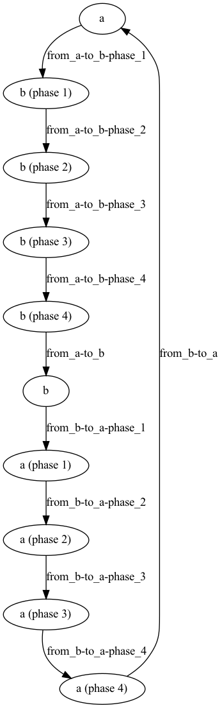

# python-osism

[](https://quay.io/repository/osism/osism)

``python-osism`` is responsible for controlling and providing various APIs within OSISM.

## Ansible

## API

## Netbox

### States

The state 0 is reserved. Newly added devices are always in state 0.

The transfer of a device from a state a to a new state b takes place in 4 phases.

In phase 1 the state of a device in the Netbox is changed.

In phase 2 the new configuration is generated based on the state in the Netbox.

In phase 3, the generated configuration is deployed on the switch.

In phase 4, the configuration on the switch is compared with the state in the Netbox.

After phase 4 is completed, the device is in the new state b.



```
dot -Tpng contrib/netbox-state-machine.dot -o contrib/netbox-state-machine.png
```
